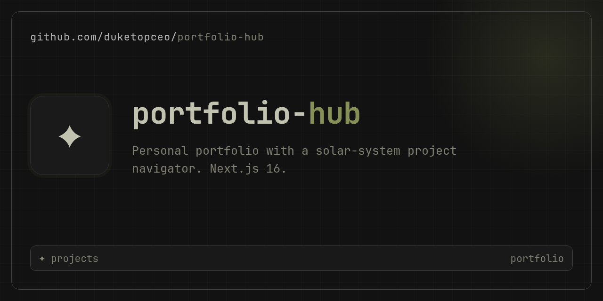

# Cosmic Intelligence — portfolio-hub

<p align="center">
  
</p>

**Live site:** [luke-the-duke.com](https://luke-the-duke.com)  
**Repo:** Next.js 16 app that powers Luke Kimball’s personal engineering portfolio.

I build OpenRouter-native systems that compound — agent harnesses, knowledge layers, production platforms, and the ops layer behind them. This site is how hiring managers and collaborators see that work: curated dossiers, live activity, and a direct hire path.

| Link | Purpose |
|------|---------|
| [luke-the-duke.com](https://luke-the-duke.com) | Homepage — orbits + activity |
| [/hire](https://luke-the-duke.com/hire) | Hire conversation |
| [/resume](https://luke-the-duke.com/resume) | Web résumé |
| [/projects](https://luke-the-duke.com/projects) | Full catalog grid |

---

## What Cosmic Intelligence is

**Cosmic Intelligence** is the brand and design system for this portfolio — deep-space dark UI, teal accent, modular “worlds” on orbital rails, and dossier pages for each repository. It is the canonical hub; other projects in the ecosystem link back here.

The homepage is not a flat project list. It is a **solar map**:

- **Primary orbit** — five featured systems (Khan, Kurultai, Pace Server, OpenRouter Demos, Stratum Engine)
- **Secondary orbit** — ~20 smaller catalog worlds on offset double rings (same planet module, scaled down)
- **Activity strip** — GitHub App history ingested (~90 days), displayed as condensed charts + grouped PRs with a **7d / 30d / 90d** range toggle

Each planet is a **modular visual** (size, shape, color, optional rings and moons) driven from catalog data — not identical dots.

---

## Catalog & orbits

All projects live in **`src/data/projects.ts`** — the single source of truth. Nothing is auto-discovered from GitHub.

| Tier | Homepage | How to set |
|------|----------|------------|
| **Featured** | Primary orbit (5) | `featured: true` + listed in `HOMEPAGE_FEATURED_SLUGS` |
| **Secondary** | Catalog orbit (~20) | Default for every other catalog entry |
| **Catalog-only** | Grid + dossier only | `orbitTier: "catalog-only"` |

**Adding a repo:** follow **[docs/PROJECT-CATALOG-SOP.md](docs/PROJECT-CATALOG-SOP.md)** — slug, dossier copy, optional `planetVisual`, deployments, privacy rules.

**Orbit helpers:** `src/lib/project-completeness.ts` (featured list, secondary sort) · `src/lib/planet-visual.ts` (planet appearance) · `src/components/planet/PlanetNode.tsx` (shared renderer).

**Activity pipeline:** GitHub App → `src/lib/github-activity.ts` (~90d ingest, ISR) → `src/lib/activity-aggregate.ts` (by day/week, by PR) → `ActivityCondensedPanel`.

---

## Local development

```bash
git clone https://github.com/duketopceo/portfolio-hub.git
cd portfolio-hub
npm ci
cp .env.example .env.local   # optional: GITHUB_APP_* or GITHUB_TOKEN
npm run dev                  # http://localhost:3000
```

| Command | Purpose |
|---------|---------|
| `npm run dev` | Dev server (port 3000) |
| `npm run test` | Vitest (helpers + orbit/activity) |
| `npm run lint` | ESLint |
| `npm run build` | Production build |

Fixtures for activity UI without GitHub: `ACTIVITY_USE_FIXTURES=1 npm run dev`.

Secrets stay server-side — see **[docs/SECURITY-ENV.md](docs/SECURITY-ENV.md)** and **[docs/GITHUB-APP.md](docs/GITHUB-APP.md)**.

---

## Deployment (Railway)

**Production:** Railway GitHub-connected service **`portfolio-hub`**. Push to `main` → `Dockerfile` + `railway.json` build → healthcheck on `/api/health` → **luke-the-duke.com**.

| Item | Detail |
|------|--------|
| Config | `railway.json`, `Dockerfile` |
| Docs | **[docs/RAILWAY.md](docs/RAILWAY.md)** |
| Variables | `GITHUB_APP_*` or `GITHUB_TOKEN`, optional `GITHUB_USER` |

This is the primary deploy path for this repo. No Swarm step required for site updates.

**Legacy self-hosted Swarm** (homelab cluster1–3) is documented in **[docs/CLUSTER.md](docs/CLUSTER.md)** for reference only — not how luke-the-duke.com ships today.

---

## Repo layout (high level)

```
src/
├── app/                 # Next.js App Router (/, /projects, /about, /hire, …)
├── components/
│   ├── planet/          # PlanetNode — modular orbit worlds
│   ├── activity/        # ActivityCondensedPanel, range toggle, day chart
│   └── dossier/         # Project detail sections
├── data/
│   ├── projects.ts      # Catalog (28 repos)
│   └── deployments.ts   # Live URL mapping
└── lib/
    ├── github-activity.ts
    ├── activity-aggregate.ts
    ├── planet-visual.ts
    └── project-completeness.ts
```

---

## API

`GET /api/repos` — JSON list of enriched catalog projects (ISR).  
`GET /api/activity` — homepage activity showcase.  
`GET /api/health` — Railway health probe.

---

## Docs index

| Doc | Topic |
|-----|-------|
| [PROJECT-CATALOG-SOP.md](docs/PROJECT-CATALOG-SOP.md) | Add repos, orbits, planet visuals |
| [RAILWAY.md](docs/RAILWAY.md) | Production deploy |
| [GITHUB-APP.md](docs/GITHUB-APP.md) | Activity + private repo access |
| [CLUSTER.md](docs/CLUSTER.md) | Legacy Swarm (reference) |
| [AGENTS.md](AGENTS.md) | Agent / cloud dev notes |

**Version:** `3.1.0` (see [CHANGELOG.md](CHANGELOG.md)).
