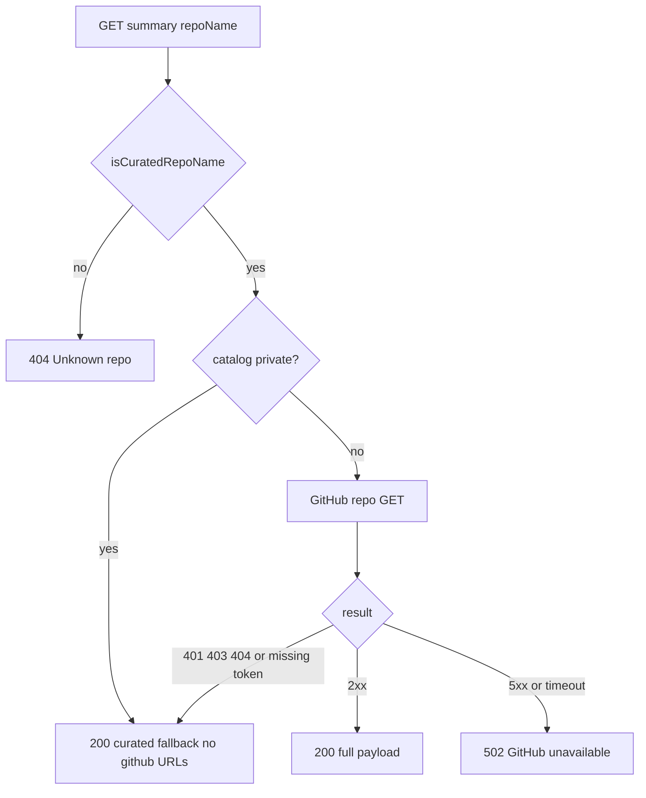
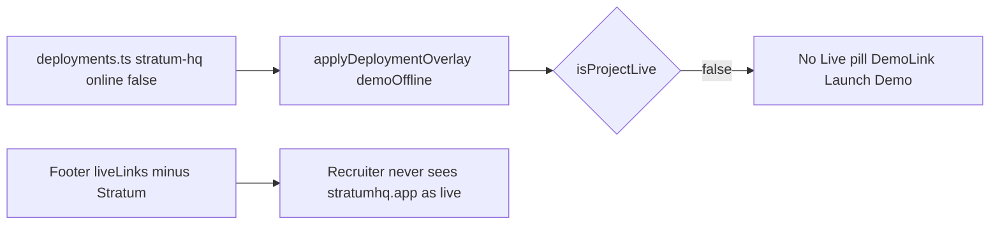

# Recruiter-Facing Portfolio Polish - Plan

## Goal Capsule

- **Objective:** Make luke-the-duke.com a recruiter-first public site: a hiring manager can tell who Luke is, open source for public work, and start a hire conversation without 404s, 502s, or a dead Stratum 525.
- **Authority:** This plan. Product Key Decisions KD1–KD4 are session-settled and are not re-opened. Repo files named in units override prior audit notes when they disagree.
- **Stop conditions:** Feature branch and PR exist; Definition of Done is met; `main` is not merged; `deploy.yml` is not dispatched; Swarm is not git-pulled.
- **Execution profile:** Code in `duketopceo/portfolio-hub` only. Smoke-first for routes and links. Unit tests only for the GitHub URL gate and summary status mapper.
- **Tail ownership:** A later lane deploys after this repo and the parallel polish lane are both ready. This lane does not ship to the cluster. The second repo is owned by that parallel lane, not named here.

---

## Product Contract

### Summary

Add `/about`, `/contact`, and `/hire`. Give public catalog and dossier entries a working GitHub click-through. Stop the GitHub summary API from 502ing expected failures. Stop advertising Stratum as live. Lead the in-repo README with who Luke is. Document env names without values. Keep the GitHub repo private unless a later decision changes that.

Product Contract authored in this bootstrap. No upstream brainstorm.

### Problem Frame

A hiring manager who lands on luke-the-duke.com in about 90 seconds cannot tell who Luke is or how to hire him. `/about` and `/contact` 404. Catalog cards open a GitHub-summary modal that 502s. The footer’s first live link is Stratum, which 525s. The GitHub repo is private with an empty description and an ops-first README. Completeness is high; the hire path is missing.

### Key Decisions

- KD1. Recruiter-first public site (session-settled: user-directed — chosen over homelab-ops README as first impression: a hiring manager in 90s cannot tell who Luke is). Governs R1, R10, R12.
- KD2. No ship-to-cluster this lane (session-settled: user-directed — chosen over ship-to-cluster now: polish this repo and the parallel lane first, then pull). Governs R11.
- KD3. Env names only, never secret values in client or docs (session-settled: user-directed — chosen over baking tokens into client: leak audit found no `ghp_` in JS). Governs R9.
- KD4. Personal duketopceo scope (session-settled: user-directed — chosen over mixing Bartlett-server-001 copy onto the personal site: a dossier already leaked a hostname). Governs R8.

### Requirements

**Hire path**

- R1. `/about`, `/contact`, and `/hire` return 200 with recruiter-facing copy and appear in header, footer, welcome chips, and the sitemap.
- R2. `/contact` and `/hire` reach a public personal mailto. They do not add a form backend.
- R3. Typed `/about`, `/contact`, or `/hire` never hits `not-found.tsx`.

**Catalog and GitHub**

- R4. A recruiter can open GitHub for a public catalog project from the card and from the dossier.
- R5. Private catalog projects never emit a public `github.com` URL and never send the recruiter into a 502 GitHub modal.
- R6. `GET /api/github/repo/:name/summary` does not return 502 for unknown, private, unauthorized, or not-found GitHub responses.

**Live advertising**

- R7. The site does not present Stratum (`stratumhq.app`) as a live product. Footer, live count, Live pills, and Launch Demo stay consistent with that.

**Scope and secrets**

- R8. New public site copy stays duketopceo personal. It may name Bartlett Roofing as an employer. It must not include Bartlett hostnames, Tailscale IPs, or cluster node names. Existing ops docs (`docs/CLUSTER.md`) may keep node names. README below-the-fold Swarm instructions must point at `docs/CLUSTER.md` instead of repeating node names.
- R9. No GitHub token or other secret is added to client code or committed files. Docs list env names only.
- R10. `README.md` leads with who Luke is and what the site is. Swarm and deploy stay below that lead.

**Landing**

- R11. This lane does not merge to `main`, dispatch `deploy.yml`, or git-pull Swarm.
- R12. GitHub About description and topics are set for a recruiter-facing first impression. Visibility stays private unless a later decision changes it.

### Actors

- A1. Recruiter — unauthenticated public visitor on luke-the-duke.com.
- A2. Implementer — lands the feature branch and PR, does not merge to `main`.

### Key Flows

- F1. Hire in 90 seconds
  - **Trigger:** A1 opens `/` or types `/about`.
  - **Actors:** A1
  - **Steps:** Read who Luke is. Open Hire or Contact. Reach mailto.
  - **Outcome:** Conversation can start. Covered by R1, R2, R3.
- F2. Public repo click-through
  - **Trigger:** A1 clicks GitHub on a public catalog card or dossier.
  - **Actors:** A1
  - **Steps:** New tab opens `https://github.com/duketopceo/<repoName>`.
  - **Outcome:** Recruiter sees source. Covered by R4.
- F3. Private project inspect
  - **Trigger:** A1 clicks a private catalog card.
  - **Actors:** A1
  - **Steps:** Dossier opens. No GitHub href. No summary 502. Existing “source on request” copy remains.
  - **Outcome:** Site looks intact. Covered by R5, R6.

### Acceptance Examples

- AE1. Covers R1, R3. Given the App Router, when A1 visits `/about`, `/contact`, and `/hire`, then each is 200 and listed in `sitemap.ts`.
- AE2. Covers R4. Given a catalog row with `private: false`, when A1 uses the GitHub control, then a new tab opens the matching `duketopceo` repo URL.
- AE3. Covers R5. Given a catalog row with `private: true`, when A1 uses the card, then no `github.com` href is rendered and the summary modal is not fetched.
- AE4. Covers R6. Given a curated private `repoName` and a GitHub 404 or 401, when the summary route is called, then the response is not 502.
- AE5. Covers R7. Given current `Footer` live links and `deployments.ts`, when the page renders, then Stratum is not a live CTA and `stratum-hq` is not counted live.

### Success Criteria

- A recruiter can answer “who is this person” and “how do I hire them” from the site without leaving to a 404.
- Public work has a working GitHub href. Private work does not 404 on github.com from this site.
- Footer and live pills do not send A1 to a 525 Stratum origin.
- `npm run build` passes. New helper tests pass. Known `SolarSystemNav.tsx` lint failure is not treated as a regression from this work.

### Scope Boundaries

**In scope**

- App Router pages, nav, sitemap, catalog GitHub CTA, summary API status mapping, Stratum live flags, README lead, GitHub description/topics, CHANGELOG Unreleased, env-name docs.

**Deferred to Follow-Up Work**

- Swarm git pull / `docker service update` / `workflow_dispatch` of `deploy.yml`.
- Making `duketopceo/portfolio-hub` public.
- Merging or closing GitHub PR #18.
- `www` NXDOMAIN / Cloudflare DNS.
- Catalog cut from 27 to 18 (PR #18 modular catalog).
- LinkedIn URL or resume file until the user supplies them.
- Fixing `SolarSystemNav.tsx` `react-hooks/set-state-in-effect` unless it blocks this PR.
- Deleting unused `RepoDetailModal` after cards stop opening it.
- Completeness scorer `repo` bonus (`getEnrichedProjects()` currently sets `repo: null`).
- Podcast copy that mentions Stratum under `public/podcast/` (`SiteChrome` already hides Header/Footer on `/podcast`).

**Outside this product's identity**

- Bartlett Optiplex/ordu, Bartlett-server-001, or any Bartlett hostname in public copy.
- Contact forms, CRM, or Notion as a hire backend.

### Open Questions

- OQ1. **Deferred.** Keep the GitHub repo private, or make it public after README polish? Default: stay private (R12). Description and topics still get set.
- OQ2. **Deferred.** Fix PR #18 CHANGELOG vs close the PR? Default: leave #18 open and unmerged. This lane adds bullets under current `CHANGELOG.md` Unreleased only.

### Sources

- Live audit canvas (2026-08-16): about/contact missing, summary 502, footer Stratum 525, GitHub repo private with empty description.
- `docs/PORTFOLIO_HUB_ENDPOINT_AUDIT_2026-08-15.md` — prior endpoint table. Re-verified in code, not copied as live truth.
- `docs/SECURITY-ENV.md`, `.env.example` — env name canon.
- `docs/CLUSTER.md`, `docker-compose.yml` — stack `portfolio` already exists.
- `.github/workflows/deploy.yml` — `push` to `main` runs `deploy-swarm`.
- GitHub: repo private, empty description, topics unset. PR #18 `DIRTY` / `CONFLICTING`.

---

## Planning Contract

### Key Technical Decisions

- KTD1. Stay off `main` this lane. (session-settled: user-directed — chosen over ship-to-cluster now: polish this repo and the parallel lane first, then pull). Instantiates KD2 / R11.
  - **Conflict call-out:** Skipping `workflow_dispatch` is not enough. `deploy.yml` also runs `deploy-swarm` on `push` to `main`. An unmerged feature branch is the HOW that keeps KD2 true.
- KTD2. Catalog primary click goes to the dossier. Public GitHub is a separate `DemoLink`-style control. Instantiates R4, R5.
  - Rejected: whole-card click to GitHub (private rows 404 for A1). Rejected: keep `RepoDetailModal` as the only GitHub path (today it 502s and `githubPath` is not an `<a>`).
- KTD3. Build `githubUrl` from curated `withDeploy.private` and a non-empty `repoName` before any GitHub `private` overwrite. Catalog-private rows get `githubUrl: null` even if GitHub reports the repo public. Do not import `@/lib/github` into client components. Instantiates R4, R5, R9.
- KTD4. Summary API: 404 if not curated. Catalog-private curated names do not call GitHub; return 200 curated fallback with empty pulls and no `githubPath` or pull `htmlUrl`. Catalog-public: 200 full payload on GitHub 2xx; 200 curated fallback on GitHub 401/403/404 or missing token; 502 only for timeout or GitHub 5xx. Mirror `src/app/api/github/pulls/route.ts` degrade, not Traefik overlay `docs/AUDIT-502.md`. Instantiates R5, R6.
- KTD5. Delist Stratum as live in `src/data/deployments.ts` (`online: false`) and remove the Footer `liveLinks` row. Gate dossier demo chrome with `isProjectLive`. Keep the `stratum-hq` catalog row. Instantiates R7.
- KTD6. Three routes, one CTA. `/about` is bio. `/hire` is intent plus mailto. `/contact` is the same mailto, not a third essay. Default address: `kimballluke@gmail.com` from `COSMIC-REBRAND-PLAN.md`. Never `luke.k@bartlettroofs.com`. Instantiates R1, R2, KD4.
- KTD7. Keep monolithic `src/data/projects.ts`. Do not merge PR #18. Under current `## [Unreleased]`, add a sibling heading next to `### Docs` (for example `### Changed`) for this lane’s bullets. Do not append hire-path work under `### Docs`. Do not take PR #18’s Unreleased headings.
- KTD8. Rewrite the README lead in-repo even while the GitHub repo stays private. Set GitHub description and topics with `gh repo edit` without changing visibility. Instantiates R10, R12, KD1.
- KTD9. Do not add a new Swarm stack file. `docker-compose.yml` already deploys stack `portfolio` with Traefik labels and `/api/health`. Instantiates the “if not Swarm-defined, make it so” gate: it is already defined.
- KTD10. Add Vitest for two pure helpers only: public GitHub URL gate, summary HTTP status mapping. `npm run build` remains the app gate. Do not fail this lane on the existing `SolarSystemNav.tsx` lint error.

### High-Level Technical Design

```mermaid
flowchart TD
  land[A1 lands on /] --> about["/about bio"]
  about --> hire["/hire or /contact mailto"]
  land --> catalog[/projects]
  catalog --> card{Card action}
  card -->|body| dossier["/projects/slug"]
  card -->|GitHub CTA and public| gh[github.com duketopceo repo]
  card -->|GitHub CTA and private| none[No href]
  dossier --> ghCta{private?}
  ghCta -->|no| gh
  ghCta -->|yes| request[Source on request]
```





### Assumptions

- Public hire email is `kimballluke@gmail.com` until the user names another personal address.
- No LinkedIn or resume this lane.
- Catalog stays 27 rows. PR #18’s 18-row cut is out of scope.
- “Cosmic Intelligence” remains in-app brand. Recruiter copy still names Luke Kimball in `/about` and README lead.
- `GITHUB_TOKEN` may be unset in local and still must not 502 the recruiter for expected GitHub misses.

### Implementation Constraints

- Next.js 16 App Router, React 19, TypeScript 5.9. No `NEXT_PUBLIC_` GitHub token exists today. Do not add one.
- Client components must not import modules that read `process.env.GITHUB_TOKEN`.
- `AGENTS.md` currently has no test runner. This plan adds Vitest for helpers only.
- `scripts/cluster-deploy.sh` does `git reset --hard origin/main`. Do not run it.

### Sequencing

U2 lands Vitest before U3 uses it. U1 and U4 both edit `Footer.tsx`: apply nav and liveLinks in one Footer pass, or run U4 after U1. U2 (optional aside GitHub) and U4 (`showDemoSection`) may both touch `src/app/projects/[slug]/page.tsx`. U3 can run in parallel with U1 after U2’s helper/runner exists. U5 can run in parallel. U6 last so it records what landed.

### Risks and Dependencies

- Merging to `main` deploys Swarm. Mitigation: KTD1.
- PR #18 CHANGELOG conflict. Mitigation: KTD7.
- Missing token still 502s today’s summary route. Mitigation: KTD4.
- `showDemoSection` ignores `demoOffline`. Overlay alone would still show Stratum demo chrome on a public slug. Mitigation: KTD5.
- Contact email in a public page is intentional. Do not put it in `src/data/projects.ts` (that file forbids emails).

---

## Implementation Units

### U1. Recruiter about contact hire routes

- **Goal:** A recruiter can read who Luke is and start a hire conversation without a 404.
- **Requirements:** R1, R2, R3, R8. KD1, KD4. KTD6.
- **Dependencies:** None.
- **Files:**
  - create `src/app/about/page.tsx`
  - create `src/app/contact/page.tsx`
  - create `src/app/hire/page.tsx`
  - modify `src/components/Header.tsx`
  - modify `src/components/Footer.tsx`
  - modify `src/components/WelcomeIntro.tsx`
  - modify `src/app/sitemap.ts`
  - modify `src/app/not-found.tsx`
- **Approach:**
  1. Add three App Router pages using `src/app/now/page.tsx` shell: `cosmic-page cosmic-page--shell`, `projects-page-header` eyebrow/title/sub, `export const metadata`.
  2. `/about`: Luke Kimball, personal systems builder, current role as IT Support and Data Specialist at Bartlett Roofing as employer only. No hostnames or cluster names per R8.
  3. `/hire` and `/contact`: same mailto CTA per KTD6. `/hire` states availability intent. `/contact` is the address and GitHub profile link already used in `Header.tsx` (`https://github.com/duketopceo`).
  4. Wire `navItems`, footer Navigation (include `/now` while touching it), WelcomeIntro chips, sitemap URLs, and a `not-found` link to `/hire`.
- **Patterns to follow:** `src/app/now/page.tsx` layout and metadata. Header `navItems` shape.
- **Execution note:** Smoke the three URLs in the browser after build. Do not treat lint of unrelated `SolarSystemNav.tsx` as this unit’s gate.
- **Test scenarios:**
  - Happy path: Request `/about`, `/contact`, `/hire`. Each renders a heading and does not use `not-found.tsx`.
  - Happy path: Header, footer, and WelcomeIntro chips contain About, Contact, and Hire links. Sitemap includes all three absolute `luke-the-duke.com` URLs.
  - Edge: `/contact` and `/hire` both contain `mailto:kimballluke@gmail.com` and no Bartlett email.
  - Error: Visiting an unknown path still uses `not-found.tsx` and offers a path back to `/hire` or `/projects`.
- **Verification:** `npm run build` includes the new routes. Local `/about` `/contact` `/hire` are 200. Copy has no Tailscale IP or Bartlett hostname.

### U2. Public GitHub click-through

- **Goal:** Public projects open on GitHub. Private projects do not 404 there and do not 502 a modal.
- **Requirements:** R4, R5, R9. KTD2, KTD3, KTD10.
- **Dependencies:** None.
- **Files:**
  - modify `src/lib/types.ts`
  - modify `src/lib/github.ts`
  - modify `src/components/ProjectCard.tsx`
  - modify `src/components/DemoLink.tsx` or add a sibling GitHub link component next to it
  - modify `src/components/dossier/ProjectHero.tsx`
  - modify `src/app/projects/[slug]/page.tsx` if the aside still lacks GitHub
  - create `src/lib/github-public-url.ts`
  - create `src/lib/github-public-url.test.ts`
  - modify `package.json` (add `vitest` and `test` script)
- **Approach:**
  1. Add Vitest and an `npm test` script. Later U3 reuses this runner and does not re-add it.
  2. Extract a pure helper: given curated `private` and `repoName` plus account login, return a URL or `null`.
  3. In `getEnrichedProjects()`, compute `githubUrl` from curated `withDeploy.private` and a non-empty `repoName` **before** applying `repo?.private`. Catalog-private rows stay `null` even when GitHub reports public.
  4. Change `ProjectCard` body click from `RepoDetailModal` to the dossier (`/projects/${slug}`), matching `SolarSystemNav` / quadrant. Do not mount or fetch `RepoDetailModal` from the card.
  5. Add a GitHub control using `DemoLink`’s `target="_blank"` `rel="noopener noreferrer"` `stopPropagation` pattern. Render it only when `githubUrl` is set.
  6. Add the same CTA on `ProjectHero` for public rows. Private keeps the existing Private Repository pill and availability sentence.
- **Patterns to follow:** `src/components/DemoLink.tsx`. Do not import `@/lib/github` into `"use client"` files.
- **Execution note:** Implement the URL helper test-first. Then wire UI.
- **Test scenarios:**
  - Covers AE2. Helper with `private: false` and `repoName: "kurultai"` returns `https://github.com/duketopceo/kurultai`.
  - Covers AE3. Helper with `private: true` returns `null`.
  - Edge: Empty `repoName` returns `null`.
  - Integration: Public card markup includes an `<a href>` to GitHub. Private card markup does not, and the card does not request `/api/github/repo/:name/summary` or mount `RepoDetailModal`.
- **Verification:** Public dossier and card have View on GitHub. Private card opens dossier only. No client bundle reads `GITHUB_TOKEN`.

### U3. GitHub summary status mapping

- **Goal:** The summary route stops 502ing expected GitHub misses.
- **Requirements:** R5, R6. KTD4, KTD10.
- **Dependencies:** U2 (Vitest runner).
- **Files:**
  - modify `src/lib/github-repo-api.ts`
  - modify `src/app/api/github/repo/[repoName]/summary/route.ts`
  - create `src/lib/github-summary-status.ts`
  - create `src/lib/github-summary-status.test.ts`
- **Approach:**
  1. Stop throwing on non-OK repo GET inside `fetchRepoSummaryPayload`. Return a result the route can map.
  2. Status mapper: not curated → 404. Catalog-private curated → skip GitHub, HTTP 200 curated fallback, empty pulls, no `githubPath` or pull `htmlUrl`. Catalog-public + GitHub 401/403/404 or missing token → 200 curated fallback. Catalog-public + GitHub 200 → 200 full payload. Timeout or GitHub 5xx → 502.
  3. Curated fallback JSON must not include `ghp_`, `Bearer`, `Bad credentials`, or a GitHub `message` field.
- **Patterns to follow:** `src/app/api/github/pulls/route.ts` empty degrade. `ghFetch` already returns `{ ok: false, status }` — use it instead of throw.
- **Execution note:** Status mapper test-first. Do not apply Traefik overlay steps from `docs/AUDIT-502.md`.
- **Test scenarios:**
  - Covers AE4. Mapper input curated private (skip GitHub) → HTTP 200 fallback with no `github.com` URLs, even if a stub GitHub 200 would have existed.
  - Happy path: curated public + GitHub 200 → HTTP 200 full payload.
  - Edge: unknown repoName → HTTP 404.
  - Edge: curated public + missing token / GitHub 404 → HTTP 200 fallback.
  - Error: GitHub 503 or abort timeout → HTTP 502.
  - Error: GitHub 401/403 on a public curated name → HTTP 200 fallback, not 502.
  - Error: 200 fallback JSON string contains no `ghp_`, `Bearer`, `Bad credentials`, or GitHub `message` field.
- **Verification:** `npm test` passes. Calling the route for a private curated name without treating GitHub 404 as 502. Client error text “Could not load GitHub details” is gone for those rows if the modal is still used.

### U4. Stop advertising live Stratum

- **Goal:** Recruiters are not sent to `stratumhq.app` as a live product.
- **Requirements:** R7. KTD5.
- **Dependencies:** U1 (shared `Footer.tsx`).
- **Files:**
  - modify `src/data/deployments.ts`
  - modify `src/components/Footer.tsx`
  - modify `src/data/projects.ts` (`stratum-hq` tagline, description, highlights)
  - modify `src/app/projects/[slug]/page.tsx` (`showDemoSection` / `hasDemo`)
- **Approach:**
  1. Set `stratum-hq` `online: false` in `deployments.ts` so overlay sets `demoOffline`.
  2. Remove the Stratum object from Footer `liveLinks`.
  3. Set dossier `showDemoSection` to `isProjectLive(project) && !project.private` so public + `demoOffline` hides Launch Demo / demo frame without dropping the private-row guard.
  4. Rewrite `stratum-hq` tagline, description, and highlights so they do not call Stratum a live product or live shell. Keep the row. Leave URLs for overlay.
  5. Keep Chronicle Weaver, Republic Atlas, and OMHDB footer rows unless this lane finds they are also dead. Do not hunt them.
- **Patterns to follow:** `src/lib/deployments.ts` `applyDeploymentOverlay` and `isProjectLive`. Footer `liveLinks` array.
- **Test scenarios:**
  - Covers AE5. Footer live list has no `stratumhq.app`.
  - Happy path: `isProjectLive` for overlayed `stratum-hq` is false. Home live count does not include it.
  - Edge: Catalog row `stratum-hq` still exists and still has a dossier.
  - Integration: Dossier for `stratum-hq` has no Launch Demo and no live pill.
- **Verification:** Grep of `src/components`, `src/app`, and `src/data` for live-claim Stratum copy. Footer has no `stratumhq.app` href. Overlay path is the remaining URL source and is offline.

### U5. Recruiter-first README and GitHub About

- **Goal:** Anyone who opens the repo (now privately, later publicly) sees who Luke is before Swarm ops.
- **Requirements:** R10, R12, R9, R8. KD1. KTD8, KTD9.
- **Dependencies:** None.
- **Files:**
  - modify `README.md`
  - modify `.env.example` only if a name is missing (do not add values)
  - modify `docs/SECURITY-ENV.md` only to list names already used
- **Approach:**
  1. Lead README with Luke Kimball, luke-the-duke.com, what the site is, and a hire pointer to `/hire` on the live site. Keep architecture, setup, and Swarm below the fold. Below-fold Swarm text may say `docker stack deploy -c docker-compose.yml portfolio` and must point at `docs/CLUSTER.md` instead of repeating cluster node names.
  2. Do not paste tokens. Keep pointing at `.env.example` names: `GITHUB_TOKEN`, `GITHUB_USER`. Mention CI build-arg `GH_PAT` as a name only. Swarm SSH names `SWARM_HOST`, `SWARM_USER`, `SWARM_SSH_KEY` stay in deploy docs, not the README lead.
  3. Set GitHub description and topics via `gh repo edit`. Do not `gh repo edit --visibility public`. Suggested description: Cosmic Intelligence — Luke Kimball’s engineering portfolio (Next.js, luke-the-duke.com). Topics such as `portfolio`, `nextjs`, `typescript`.
  4. Do not add compose/stack files. Optionally one README sentence that production is already `docker stack deploy -c docker-compose.yml portfolio`.
- **Patterns to follow:** `.env.example` comment style. `docs/SECURITY-ENV.md` “names not values”.
- **Test expectation:** none — docs and GitHub metadata. Smoke: `gh repo view duketopceo/portfolio-hub --json description,isPrivate,repositoryTopics` shows a non-empty description and `isPrivate: true`.
- **Verification:** First screen of README answers who/what/where. `isPrivate` unchanged. No secret material in the diff.

### U6. CHANGELOG and landing discipline

- **Goal:** Record the polish under current Unreleased without colliding with PR #18, and keep this lane off `main`.
- **Requirements:** R11. KTD1, KTD7.
- **Dependencies:** U1–U5 content to name in the changelog.
- **Files:**
  - modify `CHANGELOG.md`
- **Approach:**
  1. Under the existing `## [Unreleased]` on current `main`, add a sibling heading next to `### Docs` (for example `### Changed`) for this lane’s bullets. Do not append those bullets under `### Docs`. Do not replace the CLUSTER Docs bullet. Do not take PR #18’s Unreleased headings.
  2. Open a feature branch PR to `main`. Do not merge. Do not `gh workflow run deploy.yml`. Do not SSH `git pull` on Swarm.
- **Patterns to follow:** Current Unreleased shape in `CHANGELOG.md`.
- **Test expectation:** none — changelog and process.
- **Verification:** `git diff main -- CHANGELOG.md` is additive under Unreleased. Branch is not `main`. PR is open. `deploy.yml` was not dispatched.

---

## Verification Contract

| Gate | Command / check | Applies to | Done signal |
|------|-----------------|------------|-------------|
| Helper tests | `npm test` | U2, U3 | Vitest passes for URL gate and status mapper |
| App build | `npm run build` | U1–U4 | Exit 0. Do not run `npm run build` as a production switch on a running agent `next dev` if a local server is already serving; use a one-shot CI-style build in a clean tree or accept the repo’s existing agent-dev rule and run build only when it will not clobber an active `.next` |
| Lint | `npm run lint` | advisory | Known `SolarSystemNav.tsx` failure may still exit 1. New files must not add lint errors |
| Browser smoke | local `npm run dev` | U1, U2, U4 | `/about` `/contact` `/hire` 200. Public GitHub CTA opens GitHub. Private card has no GitHub href. Footer has no Stratum live row |
| Secrets | diff review | U5, all | No token values. No `NEXT_PUBLIC_` GitHub token |
| Landing | git / `gh` | U6, KTD1 | Not on `main`. No `workflow_dispatch`. No Swarm git pull |
| GitHub About | `gh repo view` | U5 | Description non-empty. `isPrivate: true` unless OQ1 is later flipped |

Do not run `scripts/cluster-deploy.sh`. Do not `docker stack deploy` as a now-step.

---

## Definition of Done

- All units U1–U6 meet their Verification fields.
- R1–R12 are true on the feature branch.
- KD1–KD4 remain honored: recruiter-first copy, no cluster ship, env names only, no Bartlett internals in new copy.
- Abandoned experiments are not left in the diff.
- A PR exists against `main` and is **not merged**.
- Swarm pull remains a later lane.

---

## System-Wide Impact

- **CI/CD:** Any merge to `main` builds GHCR and SSHs `docker service update` on `portfolio_portfolio`. This lane must not merge.
- **Runtime env:** App already expects `GITHUB_TOKEN` at container runtime in `docker-compose.yml` `environment:`. This lane does not change secret wiring. It documents names.
- **Public PII:** Personal email becomes visible on `/contact` and `/hire`. That is the hire path. Keep it out of `src/data/projects.ts`.
