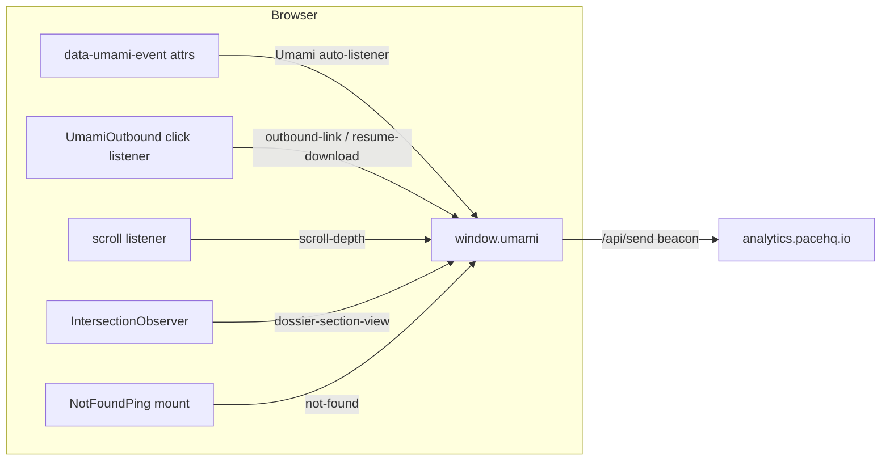

## Summary

Umami is already wired (`src/app/layout.tsx`, `beforeInteractive` script to
`analytics.pacehq.io`, website ID `85c70ffd-c5dc-4f8a-a18e-b13bbe101904`) and
PR #47 shipped the first funnel: pageviews, `orbit-marker`,
`survey-file-open`, `contact-email`, `resume-*`, `live-*`, `github-repo`,
`demo-*`, `intro-*`, `outbound-link`. Verified end-to-end in real BrowserOS
CDP — `script.js` fetched, `window.umami` live, `/api/send` beacon sent.

This plan closes the remaining instrumentation gaps and adds the operational
layer: scroll depth, catalog filter/sort usage, dossier section impressions,
404 hits, plus a durable analytics reference doc so future surfaces inherit
the event grammar instead of inventing it.

## Problem Frame

Today we can see *which* pages recruiters hit and *which* CTAs they click,
but not *how deeply* they engage. The three highest-value unknowns:

1. Do recruiters read past the dossier hero? (scroll depth + section
   impressions)
2. What do they filter the catalog by? (reveals what they're hiring for)
3. Are shared links rotting? (404 hits)

## Requirements

- R1 — Scroll-depth events (25/50/75/100%) on dossier and demo pages,
  firing once per threshold per pageview.
- R2 — FilterBar events: catalog-vs-PRs view switch, category filter,
  sort change — with the chosen value as event data.
- R3 — `not-found` event on the 404 page carrying the attempted path.
- R4 — Section impressions on dossier pages: which `EvidencePanel` sections
  enter the viewport, once each.
- R5 — `docs/analytics.md`: event catalog, event-data shapes, UTM
  convention, dashboard goals checklist, and the BrowserOS CDP verification
  procedure (so every future surface inherits the grammar).
- R6 — No event double-fires; `data-umami-event` elements stay excluded
  from delegated listeners. No PII, no cookies, privacy source check stays
  green.

## Scope Boundaries

- Public stats surface (live counter on `/now`, shared dashboard link) —
  deferred until real stats exist; revisit deliberately.
- Portfolio Guide `guide-*` events — deferred to the chatbot's own
  implementation plan (`docs/plans/2026-09-14-0229-feat-portfolio-guide-plan.md`).
- First-party script proxy (`/_a/script.js` for ad-blocker resilience) —
  deferred; self-hosted Umami already evades most blocklists, and the proxy
  adds a moving part not yet justified by traffic.
- Umami dashboard config (goals, weekly email report) — operator-side,
  documented in the reference doc, not code.

## Key Technical Decisions

- **Extend `UmamiOutbound` rather than new components.** It's already the
  single delegated-tracker seam mounted once in `SiteChrome`; scroll depth,
  filter delegation, and section impressions are all DOM-observer work that
  fits the same lifecycle. Rename conceptually to "the Umami tracker" —
  keep the file name to avoid churn.
- **Attribute-first, `umami.track()` second.** Prefer `data-umami-event`
  where the element owns the semantics (FilterBar buttons, 404 links); use
  imperative `track()` only for observer-derived events (scroll depth,
  section impressions) that have no single element.
- **Impressions via IntersectionObserver, one-shot.** `data-umami-section`
  attribute on `EvidencePanel` sections; observer fires
  `dossier-section-view {slug, section}` on first intersection, then
  unobserves. No scroll handler, no repeated events.
- **404 path via `data-umami-event` on a tiny client island.** Next.js
  `not-found.tsx` is a server component; a `NotFoundPing` client child
  calls `umami.track("not-found", { path })` on mount — cleaner than
  reading `location` in a delegated listener that may not see a click.
- **Scroll depth in a `requestAnimationFrame`-throttled scroll listener**,
  armed only on `/projects/*` and `/demos/*` routes, removed after 100%
  fires. Zero cost on pages where it isn't armed.

## Implementation Units

### U1. Scroll-depth tracker

**Goal:** Prove how far into dossiers/demos recruiters scroll.
**Requirements:** R1, R6
**Files:** `src/components/UmamiOutbound.tsx`
**Approach:** Inside the existing `useEffect`, add a scroll listener
(active only when `location.pathname` matches `/projects/` or `/demos/`).
Track thresholds `[25, 50, 75, 100]` crossed; fire
`umami.track("scroll-depth", { depth, page })` once each; remove listener
after 100% or unmount. rAF-throttle the handler.
**Test scenarios:**
- Mount on a long dossier page, scroll to 60% → `scroll-depth` fired with
  `depth: 25` and `depth: 50`, not 75/100.
- Scroll fast to bottom → each threshold fires exactly once (no dupes).
- Mount on `/` → no scroll listener armed (verify via no events on scroll).
**Verification:** BrowserOS CDP probe — inject scroll, assert
`__umami_calls` spy (or `/api/send` request bodies) contains the thresholds.

### U2. FilterBar + catalog-view events

**Goal:** See what recruiters filter and sort by.
**Requirements:** R2, R6
**Files:** `src/components/FilterBar.tsx`
**Approach:** Add `data-umami-event` attrs to the three interactive
surfaces: view-toggle buttons (`catalog-view`, `data-umami-event-view`),
category buttons (`catalog-filter`, `data-umami-event-category`), sort
buttons (`catalog-sort`, `data-umami-event-sort`). Umami's delegated
attribute listener picks these up — no imperative code needed.
**Test scenarios:**
- Click "PRs" toggle → `catalog-view {view: prs}`.
- Click a category → `catalog-filter {category: <key>}`.
- Click "stars" sort → `catalog-sort {sort: stars}`.
**Verification:** DOM attrs present in SSR HTML (no hydration dependency);
one click via CDP confirms beacon.

### U3. 404 ping

**Goal:** Catch rotting shared links.
**Requirements:** R3, R6
**Files:** `src/app/not-found.tsx`, new `src/components/NotFoundPing.tsx`
**Approach:** `NotFoundPing` is a 15-line client component —
`useEffect(() => window.umami?.track("not-found", { path: location.pathname + location.search }))`.
Render it inside the existing `NotFound` plate.
**Test scenarios:**
- Navigate to `/nope` → `not-found` fired with `path: /nope`.
- Umami blocked/absent → no throw (optional-chained).
**Verification:** CDP navigation to a bogus route; assert beacon.

### U4. Dossier section impressions

**Goal:** Know which evidence sections recruiters actually reach.
**Requirements:** R4, R6
**Files:** `src/components/design/EvidencePanel.tsx`,
`src/components/UmamiOutbound.tsx`
**Approach:** `EvidencePanel` gains an optional `data-umami-section={title}`
attr (derive from `eyebrow ?? title` stringified, or accept an explicit
`trackAs` prop for non-string titles). In `UmamiOutbound`, an
IntersectionObserver on `[data-umami-section]` fires
`dossier-section-view {page, section}` once each.
**Test scenarios:**
- Dossier with 4 sections, scroll through 2 → exactly 2 impressions with
  correct `section` values.
- Same section re-entering viewport → still one impression total.
- Page without EvidencePanel → observer finds nothing, no events.
**Verification:** CDP scroll probe on `/projects/<slug>`; assert
`dossier-section-view` events with section names.

### U5. Analytics reference doc

**Goal:** Durable grammar + operations doc.
**Requirements:** R5
**Files:** `docs/analytics.md`, `AGENTS.md` (one-line pointer under
"Known caveats")
**Approach:** Write the event catalog (name → data shape → where it fires),
the UTM sharing convention (`?utm_source=linkedin` etc.), the dashboard
checklist (mark `contact-email`/`resume-download` as goals, weekly email
report), and the BrowserOS CDP verification recipe (create target →
Runtime.evaluate probe → resource timing for `/api/send`), including the
:9107/:9108 port caveat.
**Test expectation:** none — documentation.
**Verification:** Doc renders; a future agent could add a new tracked
element correctly using only this doc.

## High-Level Technical Design

One client component (`UmamiOutbound`) owns all imperative tracking;
declarative `data-umami-event` attributes own everything element-bound.

## Risks & Dependencies

- **Risk:** IntersectionObserver + scroll listeners on every route adds
  listeners on pages that never need them. Mitigation: arm only on
  `/projects/*`, `/demos/*` path prefixes.
- **Risk:** `EvidencePanel` title is `ReactNode` — stringifying may be
  awkward. Mitigation: explicit `trackAs` prop fallback; worst case the
  attr is omitted and the section simply isn't tracked.
- **Dependency:** PR #47 must merge first (this plan extends
  `UmamiOutbound` and assumes the event grammar it established).
- **Dependency:** Umami must keep `data-umami-event` delegated tracking —
  it does; verified live already.

## Deferred to Follow-Up Work

- Public stats surface (visitor counter on `/now` or share-link) — user
  wants it "carefully, when we have stats."
- `guide-*` events — land with the Portfolio Guide implementation.
- First-party analytics proxy — revisit only if blockers bite.
- Umami dashboard goals + email report — operator clicks, doc'd in U5.

## Sources & Research

- Live verification (this session): `script.js` fetched, `window.umami`
  object present, `/api/send` beacon observed via BrowserOS CDP :9107.
- `src/components/UmamiOutbound.tsx` — existing delegated-click seam.
- `src/components/design/EvidencePanel.tsx` — non-collapsible `<section>`,
  drives the impressions-not-expands design.
- `src/app/not-found.tsx` — server component, drives the client-island ping.
